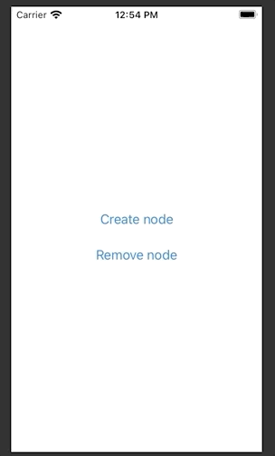
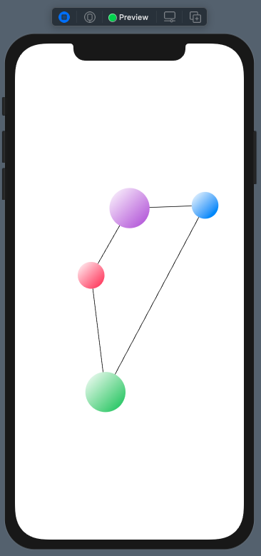
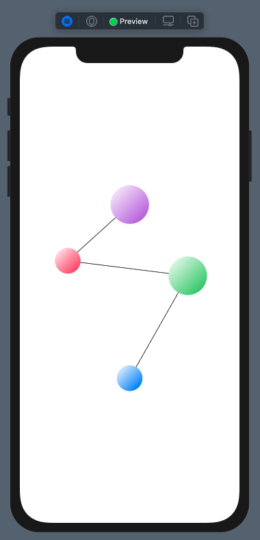
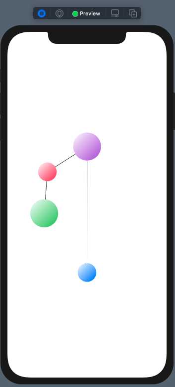
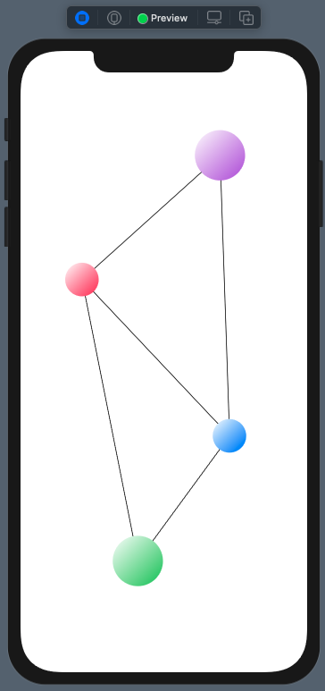
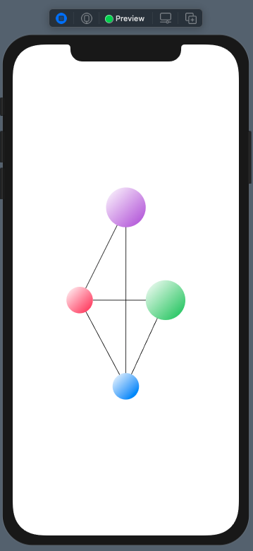

# prototype

Prototype.

## Stage 2: create and remove nodes

Add or remove nodes via simple buttons.

## Stage 1: movable nodes with arbitrary edges

Every ball can be moved around and have arbitrary connections with other balls.

## Stage 0: movable nodes

Black ball moves around, bounces back to original position.
Other balls will stay where dragged.

