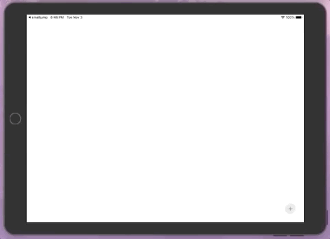

# prototype

Prototype.

## Stage 5: drag to add node; adding and removing edges

#### Drag to add a new node 

To add a new node, drag the node away from its starting point until it becomes completely opaque and then let go. You now have a new node! (If you don't drag far off, the node will snap back!)

#### Single click to add or remove edges

To add an edge, click a node (turning it red) and then click another node. An edge will be created.

To remove an edge, click a node (turning it red) and then click a node with which it already has a connection. The edge will be removed. 

Note: 
- 'enabling or disabling nodes' functionality has been removed until further iterations.
- be sure to use the app with sound on! ;-)

## Stage 4: edit mode

#### Enabled (red) and disabled (grey) nodes

A node can be enabled (red: showing edges and available to receive new edges) or disabled (gray: hiding edges and not available to receive new edges).

#### Adding new edges via editing mode (green)

New edges can be created in editing mode.

Double tap any node (enabled or disabled), turning it green. Then single tap any other enabled (ie red) node. An edge will be drawn between the green and red nodes!

Note: 
- double tapping a node also automatically re-enables it, showing its edges etc.
- when in editing mode, single tapping a disabled node has no effect (disabled nodes cannot receive new edges)

## Stage 3: enable and disable nodes

Double tap to enable or disable a node. 

Every enabled node connects to (shares edge with) every other enabled node. A disabled node connects to no nodes.

## Stage 2: create and remove nodes

Add or remove nodes via simple buttons.

## Stage 1: movable nodes with arbitrary edges

Every ball can be moved around and have arbitrary connections with other balls.

## Stage 0: movable nodes

Black ball moves around, bounces back to original position.
Other balls will stay where dragged.

